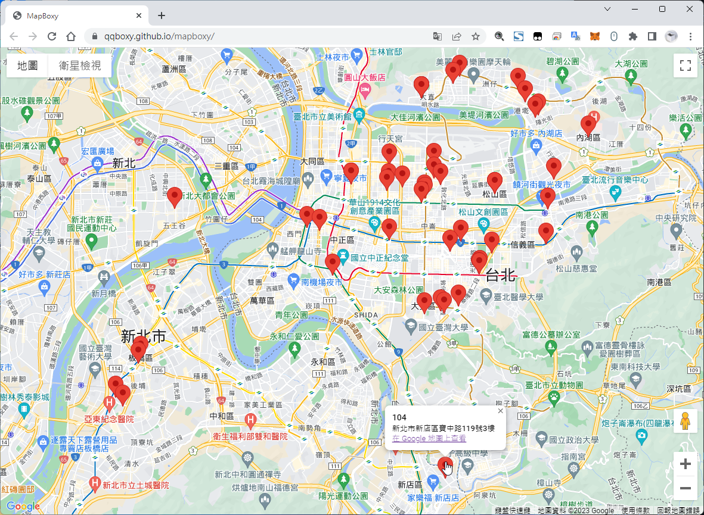

# mapboxy

MapBoxy is a simple tool to read API addresses and display markers on the map.

Demo: https://qqboxy.github.io/mapboxy/



## 

## Project Setup

```sh
yarn
```

### Compile and Hot-Reload for Development

```sh
yarn dev
```

### Compile and Minify for Production

```sh
yarn build
```

### Lint with [ESLint](https://eslint.org/)

```sh
yarn lint
```
